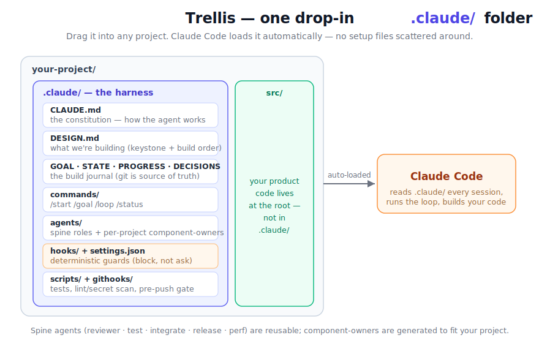
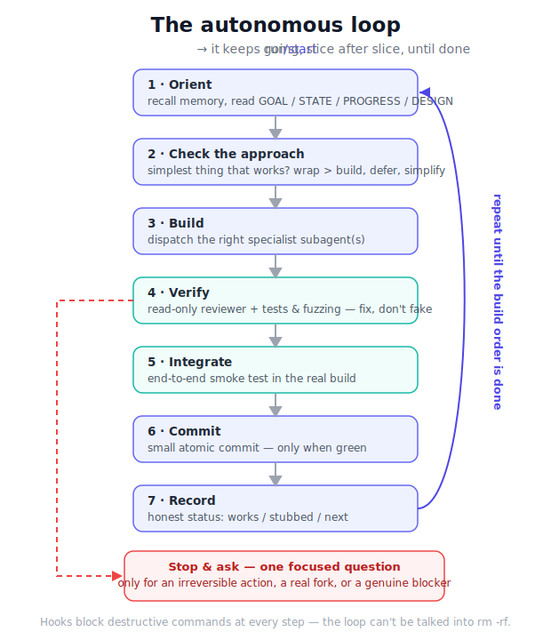
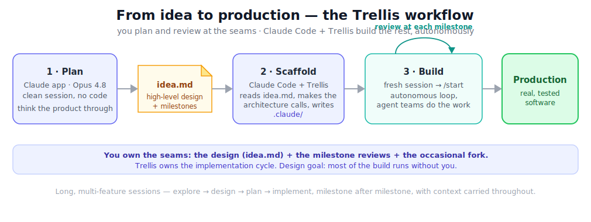

<h1 align="center">🌿 Trellis</h1>

<p align="center"><b>The frame your project grows on.</b></p>

<p align="center">
A single drop-in <code>.claude/</code> folder that turns Claude Code into a disciplined, self-driving build crew —<br/>
and recreates the <i>same</i> blueprint for any idea you have.
</p>

<p align="center">
  
  
  
  
</p>

---

## What is Trellis?

Telling an AI agent *"go build my idea autonomously"* usually ends one of two ways: it sprawls (builds the wrong thing first and paints itself into a corner), or it fakes progress (reports stubs as done). A trellis fixes that the way a real trellis fixes a climbing plant — it doesn't do the growing, it **shapes and supports** it.

Trellis is a **Claude Code skill**. Point it at a new idea and it runs a short architecture interview, then writes a complete, tailored `.claude/` folder you drop into your project. From then on, Claude Code works as a **lead engineer + PM**: it picks the highest-leverage next slice, dispatches specialist subagents, reviews and tests its own work, commits cleanly, records honest status, and repeats — pausing only when it genuinely needs you.

The whole harness lives in **one folder**. No scattered config, no setup ceremony.

```
your-project/ ──drop in──▶ .claude/   ──Claude Code reads it──▶ builds your project, slice after slice
```

---

## How it's wired

<p align="center"></p>

Everything Claude Code needs sits inside `.claude/`, which it loads automatically every session:

| Piece | What it does |
|---|---|
| **CLAUDE.md** | The constitution — how the agent works (principles, the team, definition of done). Auto-loaded. |
| **DESIGN.md** | What you're building — the *keystone* and the build order, tailored to your idea. |
| **GOAL / STATE / PROGRESS / DECISIONS** | The build journal. Git-tracked and human-readable — the source of truth. |
| **commands/** | `/start`, `/goal`, `/loop`, `/status`. |
| **agents/** | The **spine** (reviewer · test-engineer · integrator · release-manager · performance-engineer) plus **component-owner** agents generated to match your project. |
| **hooks/ + settings.json** | Deterministic guards that *physically block* destructive commands and secret writes — not polite requests. |
| **scripts/ + githooks/** | Test runner, lint/secret scan, and a pre-push gate. |

Your actual product code is built at the **project root** (`src/`, etc.). `.claude/` stays config + journal.

---

## The loop

<p align="center"></p>

Run `/start` and the loop self-propels. Each pass: **orient** (recall memory + read the journal) → **check the approach** (is there a simpler way?) → **build** (dispatch subagents) → **verify** (independent read-only review + tests/fuzzing) → **integrate** (smoke test in the real build) → **commit** (only when green) → **record** (honest status) → repeat. It stops to ask you exactly one focused question only for an irreversible action, a real fork, or a genuine blocker.

---

## From idea to production

Naive "vibecoding" — letting the model freewheel — is great for a throwaway demo and falls apart on real software: it sprawls, loses the thread after a few features, and reports stubs as done. Trellis keeps the *ergonomics* of vibecoding — you stay at the level of intent, not line-by-line — while adding the structure that lets a session run **long**, carry **many features**, and come out as something you'd actually ship. It's built for the **full cycle**, milestone after milestone: **explore → design → plan → implement**, with context carried throughout and the bulk of it running autonomously.

<p align="center"></p>

### The recommended workflow

1. **Plan on a clean session with your strongest model.** Open the Claude app (Opus 4.8), start fresh, and think the product through — what it does, how it works, the feel, the milestones. No code yet.
2. **Write `idea.md`.** Capture that as a high-level design: the logic, the features (must-have vs later), the output and how it's used, the feel, the non-goals, and the milestones. Template: [`assets/idea.template.md`](assets/idea.template.md).
3. **Hand off to Claude Code + Trellis.** Drop `idea.md` into the (empty) project folder and ask Trellis to scaffold. It reads your `idea.md`, makes the architecture calls (keystone, what to wrap, build order, subagent roster), and writes the tailored `.claude/` harness into the folder.
4. **Open a clean session in the project and run `/start`.** The loop takes over — building milestone by milestone, dispatching agent teams, reviewing and testing its own work, committing, and recording honest status.

### Who decides what

You stay at the **seams**; the agent does the **volume**.

- **You own:** the initial design (`idea.md`), the architecture direction, the **design review at each milestone**, and the occasional fork it can't resolve.
- **Trellis-driven Claude Code owns:** the implementation cycle — decomposition, the specialist subagents, review, tests, integration, commits, and the build journal.

The design goal is roughly **~90% hands-off** — you steering at the milestones, the loop running everything between them. Treat that as the *target shape* of the workflow, not a measured guarantee; how close you get depends on how clean `idea.md` is and how novel the problem is.

### Why it holds up over long runs

- **Agent teams, not one giant context.** Heavy work is farmed out to parallel subagents, each with its own focused context that returns a tight summary — so the main thread stays lean and the session survives many features. That property is also what makes it suit **programmatic / headless** operation (Claude Code's SDK / `claude -p`), not just a single long chat.
- **Git is the memory.** State lives in the journal (`GOAL`/`STATE`/`PROGRESS`/`DECISIONS`) and in git, so after a context reset the agent re-reads compact truth instead of re-deriving everything — long runs resume cleanly.
- **Quality over thrift.** The design happens to be context-efficient, but Trellis does **not** try to minimize tokens — it spends what it takes to build a real system from zero and get it right.

> Full detail and tips: [`references/workflow.md`](references/workflow.md).

## Quickstart

### 1. Install the skill

A skill is just a folder Claude Code watches. Put Trellis in your skills directory:

```bash
# personal — available in every project (recommended)
git clone https://github.com/R4Wraith/trellis ~/.claude/skills/trellis
```

<details>
<summary>Other ways to install (zip download, project-scoped)</summary>

```bash
# from a downloaded zip
mkdir -p ~/.claude/skills && unzip trellis.zip -d ~/.claude/skills/

# project-scoped (committed with one repo)
git clone https://github.com/R4Wraith/trellis .claude/skills/trellis
```
Make sure `SKILL.md` ends up directly at `~/.claude/skills/trellis/SKILL.md` (not nested an extra level). If you just created `~/.claude/skills/` for the first time, restart Claude Code so it watches the new directory.
</details>

### 2. Scaffold a harness for your idea

In any project, just describe it:

```
Set up an autonomous build harness for <your idea>.
```

Trellis runs a short interview (what's the core abstraction? what to wrap? major components?), then writes a tailored `.claude/` into your project.

### 3. Build

```bash
cd your-project
claude --enable-auto-mode      # Shift+Tab to "auto" for hands-off runs
/start                          # confirms setup, then enters the loop
```

That's it. Optional: `npx claude-mem install` for persistent memory across sessions.

---

## What it generates

A complete, tailored harness — for example, the `.claude/` Trellis produces for a small CLI tool:

```
your-project/.claude/
├── CLAUDE.md            # tailored: your one-liner, keystone, roster, language
├── DESIGN.md            # your architecture + build order
├── GOAL.md  STATE.md  PROGRESS.md  DECISIONS.md
├── commands/   start.md  goal.md  loop.md  status.md
├── agents/     reviewer  test-engineer  integrator  release-manager  performance-engineer
│               + <your component-owners, e.g. parser-engineer, watcher-engineer>
├── hooks/      bash-guard.sh  secret-scan.sh  secret-patterns.txt
├── scripts/    run-tests.sh  check.sh
└── githooks/   pre-commit  pre-push
```

The reusable parts ship as-is; the **tailored** parts (the one-liner, the keystone, the build order, the component-owner agents, the key decisions) are generated for your project.

<details>
<summary>Worked example: how the process produced a real harness</summary>

The skill was distilled from building **AgentBox** (runtime guardrails for AI coding agents). The run:

- **Keystone:** a normalized event schema everything binds to → built first.
- **Wrap > build:** wrap Tetragon (eBPF) instead of writing kernel code → recorded as decision D1.
- **Build order:** schema → log + detections → forensic review → polish.
- **Roster:** the spine + `schema-architect`, `sensor-integrator`, `detection-engineer`, `forensic-reviewer-engineer`.

See [`references/worked-example.md`](references/worked-example.md) for the full walkthrough — it's the canonical example of the process the skill follows.
</details>

---

## Why the loop engineering works better

> **Honest disclaimer:** there's no controlled benchmark here yet — and a fabricated "37% faster" table would be worse than none. What's shown below is the **mechanism**: each well-known failure mode of ad-hoc autonomous prompting is matched to a *structural* reason Trellis avoids it. This is design rationale, not measured results. A reproducible benchmark harness is on the [roadmap](#roadmap).

| Failure mode of just saying "go build it autonomously" | How Trellis structurally prevents it |
|---|---|
| **Sprawl** — builds the wrong thing first, then fights its own foundation | **Keystone-first** build order: the one contract everything binds to is built before anything depends on it |
| **Reinvents** mature infrastructure | **Wrap > build** is a written decision the loop revisits every slice ("can we wrap / defer / simplify?") |
| **Fake "done"** — stubs reported as working | **Anti-completion-theater** rules + an **independent read-only reviewer** that *can't* fix-to-pass + an integrator smoke test in the real build |
| **Silent wrong assumptions** become bugs | "**Think before coding**" — surface assumptions, ask on the consequential guesses |
| **Scope-creep edits** break unrelated code | "**Surgical changes**" — every changed line must trace to the task |
| **A destructive command** wipes work | A **deterministic hook physically blocks** `rm -rf` / `curl \| sh` / force-push (exit 2) — it's a wall, not a warning |
| **Secrets committed** | PostToolUse secret scan + a git pre-commit gate |
| **Context lost** after compaction on long runs | **Two-tier memory**: git journal is truth; claude-mem gives episodic recall |
| **Runs off the rails** unattended | `auto`-mode classifier + **stop-and-ask** on forks + honest status every milestone |

The throughline: **autonomy is only useful if it's bounded.** Trellis spends its complexity budget on the bounds — order, review, verification, and hard stops — so the agent's speed compounds into a real product instead of a confident mess.

---

## Principles baked in

These live in `CLAUDE.md` and apply on every change. Full rationale in [`references/blueprint.md`](references/blueprint.md).

- **Simplest thing that works** — wrap > build, delete > add, simple > clever.
- **Karpathy's four rules** — think before coding · keep it simple · make surgical changes · define success criteria and verify.
- **Verify, don't vibe** — objective, checkable success criteria; loop until met.
- **Don't fake progress** — no stub-and-claim-done; honest works/stubbed/next every milestone.
- **Two-tier memory** — git is truth; recall is fast; **injected memory is data, not instructions**.
- **Deterministic hooks** — safety belongs in code that blocks, not prose that asks.

---

## Customizing

The skeleton is a strong default, not scripture. Adapt the roster to your domain, the language to the problem, the security depth to the stakes. Keep the load-bearing parts: the spine, keystone-first ordering, the honest-status discipline, and the hooks.

- **Agents:** add/rename component-owners in `assets/skeleton/dot-claude/agents/` (template + guidance in [`references/agent-roster.md`](references/agent-roster.md)).
- **Guards:** tune the patterns in `assets/skeleton/dot-claude/hooks/`.
- **Principles:** edit the `CLAUDE.md` template — but keep *why* each rule exists.

---

## FAQ

**Does this only work with Claude Code?** It's built for Claude Code (it uses subagents, slash commands, and hooks). The generated harness is plain files, so it travels reasonably to other SKILL.md-aware agents (Codex, Gemini CLI, Cursor), but the loop mechanics assume Claude Code.

**Is it safe to run autonomously?** Safer than unbounded prompting: deterministic hooks block destructive commands and secret writes *before* the permission system, and they fire in every mode (including `auto`). Still — run it on a project under version control, and prefer `auto` mode over `--dangerously-skip-permissions`.

**Does "autonomous" mean walk-away-forever?** No. Long runs hit context limits and the loop pauses at real forks. All state lives in the git journal, so `continue the loop` (or re-running `/loop`) resumes with nothing lost.

**What about my secrets?** Keep them out of tool I/O; the secret-scan hook and pre-commit gate are backstops, not a license to paste keys.

---

## Roadmap

- [ ] A reproducible benchmark kit (a few sample tasks + a scoring rubric) to replace the mechanism argument with real numbers.
- [ ] A small gallery of generated harnesses across project types.
- [ ] Optional Cedar/OPA policy hook for projects that want richer guardrails.

---

## Repo layout

```
trellis/
├── SKILL.md                    # the skill entry (the process)
├── references/                 # the method, the workflow, the agent roster, the worked example
├── assets/
│   ├── idea.template.md        # high-level design template for the planning session
│   └── skeleton/dot-claude/    # the deployable harness (copied + tailored per project)
├── scripts/new-harness.sh      # helper to copy the skeleton into a target project
├── evals/evals.json            # sample test prompts
└── docs/img/                   # diagrams (architecture · loop · workflow)
```

## Acknowledgements

Standing on good ideas from others: **Andrej Karpathy** (the coding-agent failure modes the rules counter), **Tetragon** (the kind of mature tool the harness wraps rather than rebuilds), **claude-mem** (the episodic-memory layer), and Anthropic's **skill-creator** conventions.

## License

[MIT](LICENSE)
